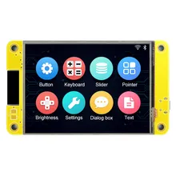
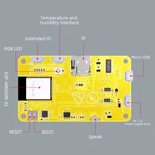
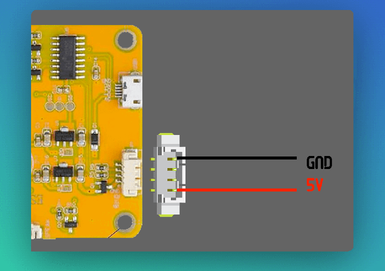

# 

[Discord Server](https://discord.gg/RytEDEgfR3)

## Table of Contents

1. [Introduction](#introduction)
   - [Required Hardware](#required-hardware)
   - [Optional Hardware](#optional-hardware)
   - [Powering the xtouch Screen](#powering-the-xtouch-screen)
2. [Features](#features)
3. [Installation](#installation)
   - [Install Drivers](#install-drivers)
   - [Prepare the SD card](#prepare-the-sd-card)
   - [Online Web Installer](#online-web-installer)
   - [Linking Printer](#linking-printer)
4. [Screens](#screens)
   - [Main](#main-screen)
   - [Temperature / Fan](#temperature--fan-screen)
   - [Control](#control-screen)
   - [Filament](#filament-screen)
   - [Settings](#settings-screen)
5. [OTA Update Procedure](#ota-update-procedure)
6. [Standard Firmware Update](#standard-firmware-update)
7. [Troubleshooting](#troubleshooting)

## Introduction

The xtouch screen is a revolutionary addition to your BambuLab Printer, enhancing the user experience and providing advanced control and monitoring capabilities. This detailed README.md guide will walk you through the product's features, installation process, and the functionality of different screens.

### Required Hardware

Currently, it has only been tested on the affordable 2.8-inch ESP32-2432S028R board, which is available for purchase here:

- [ESP32-2432S028R](https://s.click.aliexpress.com/e/_DmcFFVz)
- [ESP32-2432S028R](https://s.click.aliexpress.com/e/_EwiGjNZ)

### Optional Hardware

- **[DS18B20 Temperature Sensor](docs/temperature-sensor.md)**: For printers that do not have an integrated chamber temperature sensor, you have the option to add an external DS18B20 temperature sensor. This sensor will provide accurate chamber temperature readings and enhance the functionality of your xtouch screen. Connector on the screen is 1.25 MZ JST 4P.
- **DS18B20 P1P/P1S Chamber Temp Enclosure**: Additionally, we have created a 3D model that allows you to easily integrate the DS18B20 Temperature Sensor inside your P1P/P1S printer.

You can buy the Temperature Sensor here:

- [Temp Sensor A](https://s.click.aliexpress.com/e/_ol1shM9)
- [Temp Sensor B](https://s.click.aliexpress.com/e/_EvOTULH)

You can find the 3D models

- [Model A](https://makerworld.com/en/models/19658)
- [Model B](https://makerworld.com/en/models/42533)

### Powering the xtouch Screen

The xtouch screen can be powered in two different ways: through a USB port or via a JST 1.25 4-pin connector. Below are the details on how to power the screen using each method:

#### Powering via USB

1. Connect a suitable USB cable to an available USB port on your computer or a USB power source.

2. At the opposite end of the USB cable, connect the USB connector to the xtouch screen.

3. Ensure that the xtouch screen is turned on and that power is being supplied properly through the USB cable. The screen should light up and display the startup information.

#### Powering via the JST 1.25 4-Pin Connector

The JST 1.25 4-pin connector is an alternative method for powering the xtouch screen. Here is a pinout diagram of this connector:

To power the screen using this connector, follow these steps:

1. Locate the JST 1.25 4-pin connector on the xtouch screen.

2. Align the pins of the JST 1.25 connector with the corresponding pins on the xtouch screen.

3. Connect the JST 1.25 connector to the xtouch screen, ensuring that the pins are properly aligned.

4. Provide the proper power through the JST 1.25 connector using a compatible power source. Make sure the polarity is correct to prevent damage to the screen.

5. Turn on the xtouch screen and verify that it is receiving power properly.

The choice between USB and the JST 1.25 4-pin connector depends on your preference and resource availability. Make sure the xtouch screen receives the necessary power for optimal operation.

## Features

- **Advanced Touch Screen**: A touch screen interface for intuitive printer control.
- **Status Indicators**: Top bar indicating WiFi connectivity, camera status, timelapse recording, and AMS status.
- **Temperature Monitoring**: Real-time display of nozzle, bed, and chamber temperatures.
- **Printing Control**: Full control over your print job, including the ability to change print speed during printing.
- **Precise Control**: Control your printer's XYZ position with adjustable head movement steps (1mm and 10mm).
- **Filament Handling**: Load, unload, extrude, and retract filament (Note: Filament handling available only for printers without AMS initially).
- **Switch Between Printers**: With a single xtouch screen, you can seamlessly switch between different printers. The access code for linked printers is saved for future use, making it convenient to switch printer connections.
- **Customizable Settings**: Access a wide range of LCD and printer-related settings.
- **OTA Updates**: Enable over-the-air updates for firmware enhancements.

## Installation

### Install Drivers

[Install CH340 Drivers](https://www.wch.cn/download/CH341SER_ZIP.html)
[Install CH340 Drivers + Tutorial](https://learn.sparkfun.com/tutorials/how-to-install-ch340-drivers/all)

### Prepare the SD card

Before you begin the installation process for the xtouch screen, it's essential to properly initialize your SD card with the necessary configuration for connecting to your WiFi network. Follow these steps carefully:

1. **Format the SD Card in FAT32**:

   - Ensure your SD card is formatted with the FAT32 file system. You can use your computer's built-in formatting tools or third-party software to format the card if needed.

2. **Create a Configuration File**:

   - Use the online configuration [TOOL](https://xperiments.in/xtouch-bin/config.html) to generate a `config.json` file.
   - Place it on the root directory of the SD card.

   Your SD card is now properly initialized with the required configuration. This configuration will enable the xtouch screen to connect to your WiFi network and BambuLab servers during the installation process. Ensure that the SD card is securely inserted into the touch screen before proceeding with the installation steps outlined in the previous sections of this README.md file.

### Online Web Installer

To set up your xtouch screen, you will need to use the Online Web Installer. Follow these steps to complete the installation:

1. **Open a Web Browser**:

   - Open your preferred web browser on a computer.

2. **Enter the Web Installer URL**:

   - In the browser's address bar, enter the following URL: [https://xperiments.in/xtouch-bin](https://xperiments.in/xtouch-bin)

3. **Connect Button**:

   - On the web page, locate and click the "Connect" button to establish a connection between your computer and the xtouch screen.

4. **Select xtouch serial Port**:

   - After clicking "Connect," a list of available serial ports will be displayed. Choose the one asigned to your xtouch so establish a connection with the touch screen.

5. **Install xtouch**:

   - Once you've selected the correct serial port, click the "Install xtouch"sbutton on the web page. This will initiate the installation process.

6. **Installation Completion**:

   - Wait for the installation to complete. You will receive a confirmation message or indication on the web page once the installation process finishes.

7. **Power Off the Screen**:

   - Turn off the xtouch screen.

8. **Power On the Screen**:

   - Turn on the xtouch screen. It will now be fully initialized and ready for use with your 3D printer.

### Linking Printer

During the installation process, you will need to link your xtouch screen with your 3D printer. Follow these steps to successfully establish the connection:

1. **Searching for Printers**:

   - After powering on the touch screen, you will be greeted with a "Searching for printers" screen. The touch screen will scan for available printers.

2. **Select a Printer to Link**:

   - Once the scanning process is complete, you will be presented with a listing of the printers that were found. Select the printer you wish to link.

3. **Click the Checkmark Button**:

   - After selecting the desired printer, click the green checkmark button to initiate the linking process.

4. **Success and Main Screen**:

   - Upon successfully linking the touch screen with the printer, you will be redirected to the Main Screen. Your printer and touch screen are now connected and ready for use.

By following these steps, you will be able to link your xtouch screen with your 3D printer seamlessly, ensuring a smooth user experience and easy access to all the features of the touch screen.

## Screens

### Main Screen

- **Top Bar**: Displays WiFi, camera, timelapse, and AMS status.
- **Light Control**: Toggle the printer's light on/off.
- **Temperature Indicators**: Real-time nozzle, bed, and chamber temperature indicators.
- **Status Area**: The Status Area on the touch screen serves two main purposes:

  - **Idle State**: When the printer is not in use, it displays a "Ready" message with the main logo.
  - **Printing State**: During printing, it provides pause/stop buttons, a progress bar, layer info, and a print speed selector for real-time control and monitoring.

### Temperature / Fan Screen

On this screen, you'll find four buttons, each representing the temperature or fan speed of a specific sensor. Tapping any of these buttons will direct you to a numeric keyboard screen where you can easily adjust the corresponding temperature or speed value. After making your changes, you can return to the initial screen with a simple tap.

### Control Screen

This screen provides essential controls for managing your printer:

- **Homing**: Initiates printer homing procedure.
- **XYZ Position Control**: Enables precise control of the print head's XYZ position.
- **Step Size**: Allows you to toggle between 1mm and 10mm head movement increments for finer or quicker adjustments.

### Filament Screen

- **Filament Handling**: Load, unload, extrude, and retract filament (Note: Filament handling available only for printers without AMS initially).

### Settings Screen

#### LCD

- **Change Backlight**: In the "Change Backlight" settings, you can adjust the screen backlight to your preferred brightness level.
- **Set Screen Sleep Time**: Set Screen Sleep Time: Adjusts the screen's inactivity timer. When the screen is idle for the specified time (in minutes), it enters sleep mode to save power. Set to 0 to keep the screen always active. During an active print job, the screen stays on for real-time monitoring.
- **Invert Screen Colors**: Toggle to reverse screen colors. Useful for addressing compatibility issues with certain devices.
- **Flip Screen**: Flip the screen orientation.

#### PRINTERS

- **Unlink Printer**: Disconnect the current printer from the touch screen. This allows you to switch between different printers seamlessly.

#### XTOUCH

- **AUX FAN**: Enable the auxiliary fan for printers that initially lack it.
- **CHAMBER Temp**: Enable chamber temperature monitoring for printers without it.
- **OTA Update**: Enable OTA upgrades for firmware updates.

## OTA Update Procedure

The xtouch screen supports Over-The-Air (OTA) firmware updates, making it easy to keep your device up to date with the latest features and improvements. To enable and utilize OTA updates, follow these steps:

1. **Access the Settings Screen**:

   - Navigate to the Settings Screen on your xtouch screen.

2. **Enable OTA Updates**:

   - In the Settings Screen, locate the OTA Update section. You will find an option to enable OTA updates. Toggle this option to "ON" to enable automatic firmware update checks.

3. **Automatic Update Check on Boot**:

   - With OTA updates enabled, your touch screen will automatically check for firmware updates every time it boots up.

4. **Download and Apply Updates**:

   - If an update is available, the touch screen will automatically download the latest firmware and apply the upgrade. This process is seamless and requires no manual intervention.

By enabling OTA updates in the Settings Screen, you ensure that your xtouch screen stays current with the latest software enhancements and bug fixes without the need for manual updates. This convenient feature ensures that you always have access to the best performance and functionality that the device can offer.

## Standard Firmware Update

If you prefer to manually update the firmware of your xtouch screen or if OTA updates are not enabled, you can follow this procedure:

1. **Download the Update Firmware File**:

   - Visit the official xtouch sebsite or the designated firmware update source to download the latest firmware update file. Ensure that you download this file with the [firmware.bin](https://xperiments.in/xtouch-bin/fw/firmware.bin) name.

2. **Copy the Firmware File to the Root of the SD Card**:

   - Insert the SD card into your computer's card reader.
   - Copy the downloaded firmware update file [firmware.bin](https://xperiments.in/xtouch-bin/fw/firmware.bin) to the root directory of the SD card. Do not place it in any subdirectories.

3. **Reboot the xtouch screen**:

   - Insert the SD card containing the firmware update file into the xtouch screen if it's not already inserted.

   - Reboot the touch screen. You can do this by turning it off and then turning it back on.

4. **Apply the Firmware Update**:

   - Once the touch screen has booted up, it will detect the presence of the firmware update file on the SD card.

   - The touch screen will apply the firmware update.

   - The update process may take a few minutes to complete. Do not turn off the touch screen or remove the SD card during this time.

5. **Completion and Verification**:

   - After the firmware update is successfully applied, the touch screen will notify you that the update is complete.

   - You can verify the firmware version in the touch screen's settings section to ensure that it matches the latest version.

By following these steps, you can manually update the firmware of your xtouch screen to the latest version, ensuring that you have access to all the latest features and improvements.

## Troubleshooting

If you encounter issues during the installation or operation of your BambuLab Printers Touch Screen, you can refer to the following troubleshooting steps to resolve common problems:

1. **Use a Data Cable**:

   - Ensure that you are using a data cable (not just a charging cable) to connect your touch screen to your computer during the installation process. A data cable is required for proper communication.

2. **SD Card Compatibility**:

   - Keep in mind that SD cards from different manufacturers may behave differently. While many SD cards work seamlessly, some may not be fully compatible with the touch screen. If you experience issues with an SD card, consider trying a different brand or model to see if it resolves the problem.

3. **WiFi Connection Loop**:

   - In some cases, users have reported that after confirming their WiFi credentials are correct, the device enters into a continuous loop without establishing a connection. This issue can sometimes be resolved by adjusting the WiFi connection timeout.

   - To do this, modify the `config.json` file and include a numerical parameter for the timeout. Increasing the timeout value can help address this issue.

   - Use the [Online config.json Form](https://xperiments.in/xtouch-bin/config.html) for step-by-step instructions.

4. **Endless Reboots in Printer Startup**:

   - Sometimes, users may encounter an issue where the printer and xtouch screen go through an endless reboot cycle during the device's power-on process, preventing xtouch from becoming ready. This problem can often be resolved by adjusting the "coldboot" value within the `config.json` configuration file.

   - To address this issue, open the `config.json` file and include a numerical parameter for the "coldboot" parameter. This parameter specifies the duration in milliseconds the system should wait for initialization after a cold boot. By increasing the "coldboot" value, you provide the system with more time to complete the startup process successfully.

   - Use the [Online config.json Form](https://xperiments.in/xtouch-bin/config.html) for step-by-step instructions.

5. **Recalibrating the Screen**:

   If you encounter touch screen calibration issues or misalignment, you can recalibrate the screen by removing the `touch.json` file located in the `xtouch` directory on the SD card. Follow these steps:

   - Power off the xtouch screen.
   - Remove the SD card from the touch screen.
   - Insert the SD card into your computer.
   - Navigate to the `xtouch` directory on the SD card.
   - Delete the `touch.json` file.
   - Safely eject the SD card from your computer.
   - Reinsert the SD card into the touch screen.
   - Power on the touch screen.

   The touch screen will automatically perform a recalibration process upon startup.

